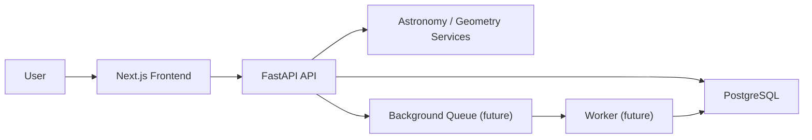

# Architecture

## System overview

## Responsibilities

- `frontend`
  - search forms
  - result list and detail views
  - map integration
- `backend`
  - search APIs
  - domain schemas
  - astronomy and geometry services
  - persistence
- `worker`
  - future home for longer-running search jobs and cache refresh tasks
- `docs`
  - requirements and implementation decisions

## Why this split

- Python is a better fit for astronomy and geospatial calculations.
- Next.js provides a fast path to usable UI and future server-side rendering.
- PostgreSQL gives a smooth upgrade path to PostGIS once spatial queries matter more.

## Near-term implementation strategy

1. Keep read APIs simple with fixture-backed endpoints.
2. Replace fixtures with repositories and database migrations.
3. Move search execution to an async worker once end-to-end correctness is confirmed.
